# CA1 Mini Project Report: Exploratory Data Analysis of MGNREGA Data
Name: Aryan Paratakke

PRN: 22070521070

Batch: 2022-26

Semester:  7th

College: Symbiosis Institute of Technology (SIT), Nagpur

Subject: Machine Learning (CA1)

Instructor: Dr. Piyush Chauhan


## 1. Introduction: Leveraging Machine Learning for Social Impact
This report documents the Exploratory Data Analysis (EDA) performed on the MGNREGA dataset as part of the Machine Learning CA1 assessment. The primary objective is to analyze the implementation and impact of the Mahatma Gandhi National Rural Employment Guarantee Act (MGNREGA) across various states and districts in India. The analysis aims to uncover trends, patterns, and insights related to employment generation, financial expenditure, and administrative efficiency under the scheme.

The chosen dataset is a powerful tool for this project, as it provides real-world data from a government source. By applying data cleaning and machine learning techniques, we can move beyond simple observation to derive actionable insights that could help improve the scheme's social impact.

All code and project directories for this analysis are publicly available at the following GitHub repository: https:://examplegithubcom.

## 2. Dataset Overview
### 2.1 Source and Purpose
- Source: The data was obtained from the official Government of India's Open Government Data (OGD) platform. Specifically, the API endpoint for "District-wise MGNREGA Data at a Glance" from this URL was used: [https://www.data.gov.in/resource/district-wise-mgnrega-data-glance](https://www.data.gov.in/resource/district-wise-mgnrega-data-glance)

- Data Extraction Methodology: The data was extracted using a programmatic approach with an API key. To handle the large volume of data, the extraction was performed batch-wise in JSON format. All the individual JSON batches were then combined into a single, comprehensive JSON file. This combined JSON file was subsequently converted into a flat CSV format for further analysis and preprocessing.

- Purpose: The dataset contains detailed, monthly metrics on the MGNREGA scheme's implementation across different districts and states of India. It is ideal for analyzing regional disparities, seasonal trends, and the effectiveness of the program.

- Data Files for Reference:
    - Original Data Folder (Batch JSON): [https://drive.google.com/drive/folders/1w79IXPB--I8TaScseNsi1SyVsp4KW7pV?usp=sharing](https://drive.google.com/drive/folders/1w79IXPB--I8TaScseNsi1SyVsp4KW7pV?usp=sharing)

    - Original Data (Combined JSON): [https://drive.google.com/file/d/1bOgJutfjL2uoTreNE09SC5rGuUnFi4mU/view?usp=sharing](https://drive.google.com/file/d/1bOgJutfjL2uoTreNE09SC5rGuUnFi4mU/view?usp=sharing)

   -  Original Data (Raw CSV): [https://drive.google.com/file/d/1-_vbSr3kQT6F_ls-elnuEuuqbVdBxg0e/view?usp=sharing](https://drive.google.com/file/d/1-_vbSr3kQT6F_ls-elnuEuuqbVdBxg0e/view?usp=sharing)

    - Final Cleaned Data (Ready for Analysis): [https://drive.google.com/file/d/1ahjab23tLf5e6lfljB58Ul6q80Dkapgs/view?usp=sharing](https://drive.google.com/file/d/1ahjab23tLf5e6lfljB58Ul6q80Dkapgs/view?usp=sharing)

### 2.2 Initial Data State
The dataset, as it was initially loaded, contained 302,753 records and 36 columns. An initial inspection showed a mixture of data types, with many numerical fields improperly stored as object (string) types due to inconsistencies in the source data. A summary of the initial state is provided below to illustrate the starting point of our data cleaning process.

Summary of Initial DataFrame:

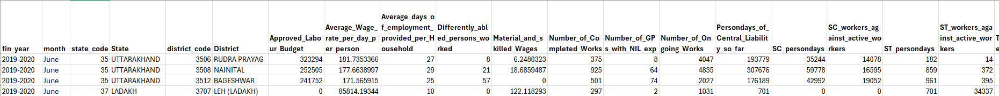
[4 rows x 36 columns]

dtypes: float64(31), object(5)

memory usage: 83.2+ MB


**Key Observations from Initial Load:**
* The dataset contains `302,753` entries and `36` columns.
* Many columns, such as `fin_year`, `month`, `State`, `District`, and `Remarks`, are of `object` (string) data type. This indicates potential inconsistencies in data entry, such as mixed month name abbreviations or leading/trailing whitespace.
* `Remarks` is a highly sparse column with only 1 non-null value, suggesting it is not a useful feature for analysis and should be handled appropriately.
* Key numerical codes (`state_code`, `district_code`) are `float64` and contain a small number of `NaN` values. This requires conversion to a proper integer type for clean categorical representation.
* The `Average_Wage_rate_per_day_per_person` and `percentage_payments_gererated_within_15_days` columns, while initially loaded as `float64`, contained extreme, physically and mathematically impossible outliers that needed specific treatment.

### 2.3 Column Details (After Cleaning and Feature Engineering)

Below is a summary of the key columns and their final state after our comprehensive data cleaning and feature engineering process. These data types and metrics form the basis of all subsequent analysis.

| Column Name | Final Data Type | Description & Significance |
| :--- | :--- | :--- |
| `fin_year` | `object` | The financial year. |
| `month` | `object` | The calendar month. |
| `state_code` | `int64` | Numerical code for the state. |
| `State` | `object` | Name of the state. |
| `district_code` | `int64` | Numerical code for the district. |
| `District` | `object` | Name of the district. |
| `Approved_Labour_Budget` | `float64` | The total approved budget. |
| `Average_Wage_rate_per_day_per_person` | `float64` | Average daily wage rate. **(Critical social indicator)** |
| `Average_days_of_employment_provided_per_Household` | `float64` | The average number of employment days provided per household. |
| `Differently_abled_persons_worked` | `float64` | Number of differently-abled persons who availed work. |
| `Material_and_skilled_Wages` | `float64` | Expenditure on materials and skilled wages. |
| `Number_of_Completed_Works` | `float64` | Total number of works completed. |
| `Number_of_GPs_with_NIL_exp` | `float64` | Number of Gram Panchayats with zero expenditure. |
| `Number_of_Ongoing_Works` | `float64` | Number of ongoing works. |
| `Persondays_of_Central_Liability_so_far` | `float64` | Total persondays generated under central liability. |
| `SC_persondays` | `float64` | Persondays generated for Scheduled Castes. |
| `SC_workers_against_active_workers` | `float64` | Ratio of SC workers to active workers. |
| `ST_persondays` | `float64` | Persondays generated for Scheduled Tribes. |
| `ST_workers_against_active_workers` | `float64` | Ratio of ST workers to active workers. |
| `Total_Adm_Expenditure` | `float64` | Total administrative expenditure. |
| `Total_Exp` | `float64` | Total overall expenditure. |
| `Total_Households_Worked` | `float64` | Total households that worked. |
| `Total_Individuals_Worked` | `float64` | Total individuals who worked. |
| `Total_No_of_Active_Job_Cards` | `float64` | Number of active job cards. |
| `Total_No_of_Active_Workers` | `float64` | Number of active workers. |
| `Total_No_of_HHs_completed_100_Days_of_Wage_Employment` | `float64` | Households that completed 100 days of wage employment. **(Crucial social impact metric)** |
| `Total_No_of_JobCards_issued` | `float64` | Total job cards issued. |
| `Total_No_of_Workers` | `float64` | Total workers registered. |
| `Total_No_of_Works_Takenup` | `float64` | Total works taken up. |
| `Wages` | `float64` | Total wages paid. |
| `Women_Persondays` | `float64` | Persondays generated by women. |
| `percent_of_Category_B_Works` | `float64` | Percentage of Category B works. |
| `percent_of_Expenditure_on_Agriculture_Allied_Works` | `float64` | Percentage of expenditure on agriculture and allied works. |
| `percent_of_NRM_Expenditure` | `float64` | Percentage of expenditure on Natural Resource Management works. |
| `percentage_payments_gererated_within_15_days` | `float64` | Percentage of payments generated within 15 days. **(Key efficiency indicator)** |
| `Remarks` | `object` | Free text remarks (mostly null and dropped). |
| `Women_Persondays_Ratio` | `float64` | **Engineered Feature:** Proportion of total persondays generated by women. |
| `SC_Persondays_Ratio` | `float64` | **Engineered Feature:** Proportion of total persondays generated by SC individuals. |
| `ST_Persondays_Ratio` | `float64` | **Engineered Feature:** Proportion of total persondays generated by ST individuals. |
| `100_Days_HH_Ratio` | `float64` | **Engineered Feature:** Ratio of households completing 100 days to total households worked. |

dtypes: float64(31), object(5)

memory usage: 83.2+ MB

## 3. Data Cleaning & Preprocessing (ETL)
The initial dataset, as sourced from the government API, was in a raw state that required a robust ETL (Extract, Transform, Load) pipeline to ensure data integrity and suitability for analysis. This process was critical for addressing inconsistencies, outliers, and preparing the data for meaningful insights.

### 3.1 Robust Data Type Conversion and Outlier Handling
The raw data presented several challenges, including columns with incorrect data types and the presence of erroneous outliers. A systematic approach was implemented to correct these issues:

- **Initial Data Types**: The initial data contained columns with a mix of data types. Specifically, a large number of numerical columns were incorrectly loaded as object (string) types. This required a programmatic approach to convert them.

- **Extreme Outliers**: Key financial and performance metrics showed physically or mathematically impossible values. For example, the Average_Wage_rate_per_day_per_person column contained outliers in the tens of millions, and percentage_payments_gererated_within_15_days had values far exceeding 100%.

**Handling Strategy**:

1. Systematic Numerical Conversion: All numerical columns were explicitly converted to float64 using pd.to_numeric(errors='coerce') to handle any non-numeric entries gracefully by converting them to NaN.

2. Imputation of NaN and inf Values: np.inf values resulting from division by zero were converted to NaN. All NaN values were then filled with 0, based on the assumption that for these metrics, a missing value represents zero activity.

3. Targeted Outlier Treatment:
    - `Average_Wage_rate_per_day_per_person`: Values were capped at a plausible upper limit (₹5,000). Zero values (where an average wage is illogical) were replaced with the median of the valid wage distribution. This corrected the extreme outliers while preserving the integrity of the data.
    - `percentage_payments_gererated_within_15_days`: This metric was clipped to a valid range of [0, 100] to ensure mathematical correctness.

### 3.2 Temporal Data Alignment and Sorting
Accurate time-series analysis requires data to be correctly aligned with the financial year. The Indian financial year, running from April to March, necessitated a custom sorting approach.

1. Financial Year Month Ordering: A custom ordered categorical data type was created for the month column, explicitly defining the sequence from 'April' to 'March'. This ensured all monthly trend visualizations would be chronologically accurate.

2. Multi-level Sorting Hierarchy: The entire DataFrame was sorted according to a strict hierarchy:
    - fin_year (ascending)
    - month (using the custom financial year order, ascending)
    - state_code (ascending)
    - district_code (ascending)

This sorting process ensured that all subsequent analyses, from yearly trends to geospatial comparisons, were based on a perfectly ordered dataset.

**Sample of Month Mapping to Sort Key:**

This table demonstrates the successful mapping of month strings to their numerical financial year order, which enabled correct sorting.

--- Sample of Month Mapping to Sort Key ---
| month     | month_sort_key |
| :-------- | :------------- |
| April     | 0              |
| May       | 1              |
| June      | 2              |
| July      | 3              |
| Aug       | 4              |
| August    | 4              |
| Sep       | 5              |
| September | 5              |
| Oct       | 6              |
| October   | 6              |
| Nov       | 7              |
| November  | 7              |
| Dec       | 8              |
| December  | 8              |
| Jan       | 9              |
| January   | 9              |
| Feb       | 10             |
| February  | 10             |
| Mar       | 11             |
| March     | 11             |

DataFrame Sorted Successfully (Head showing multi-level sort):

--- DataFrame sorted successfully. ---
| fin_year  | month | state_code | State             | district_code | District               |
| :-------- | :---- | :--------- | :---------------- | :------------ | :--------------------- |
| 2018-2019 | April | 1          | ANDAMAN AND NICOBAR | 101           | SOUTH ANDAMAN          |
| 2018-2019 | April | 1          | ANDAMAN AND NICOBAR | 102           | NICOBARS               |
| 2018-2019 | April | 1          | ANDAMAN AND NICOBAR | 103           | NORTH AND MIDDLE ANDAMAN |
| 2018-2019 | April | 2          | ANDHRA PRADESH    | 201           | SRIKAKULAM             |
| 2018-2019 | April | 2          | ANDHRA PRADESH    | 202           | VIZIANAGARAM           |
| 2018-2019 | April | 2          | ANDHRA PRADESH    | 203           | VISAKHAPATANAM         |
| 2018-2019 | April | 2          | ANDHRA PRADESH    | 204           | EAST GODAVARI          |
| 2018-2019 | April | 2          | ANDHRA PRADESH    | 205           | WEST GODAVARI          |
| 2018-2019 | April | 2          | ANDHRA PRADESH    | 206           | KRISHNA                |
| 2018-2019 | April | 2          | ANDHRA PRADESH    | 207           | GUNTUR                 |
| 2018-2019 | April | 2          | ANDHRA PRADESH    | 208           | PRAKASAM               |
| 2018-2019 | April | 2          | ANDHRA PRADESH    | 209           | NELLORE                |
| 2018-2019 | April | 2          | ANDHRA PRADESH    | 210           | CHITTOOR               |
| 2018-2019 | April | 2          | ANDHRA PRADESH    | 211           | Y.S.R                  |
| 2018-2019 | April | 2          | ANDHRA PRADESH    | 212           | ANANTAPUR              |
| 2018-2019 | April | 2          | ANDHRA PRADESH    | 213           | KURNOOL                |
| 2018-2019 | April | 3          | ARUNACHAL PRADESH | 301           | TAWANG                 |
| 2018-2019 | April | 3          | ARUNACHAL PRADESH | 302           | WEST KAMENG            |
| 2018-2019 | April | 3          | ARUNACHAL PRADESH | 303           | EAST KAMENG            |
| 2018-2019 | April | 3          | ARUNACHAL PRADESH | 304           | LOWER SUBANSIRI        |

### 3.3 Anomaly Investigation and Filtering
A critical discovery during the ETL phase was a significant anomaly in the data for the 2024-2025 financial year. This year showed disproportionately high metrics, which upon investigation, was found to be due to a change in the data's reporting granularity, not a genuine surge in activity. The 2025-2026 financial year was also excluded as the data was incomplete.

To ensure our analysis was based on genuinely comparable historical trends, a professional decision was made to filter out both the '2024-2025' and '2025-2026' financial years.

DataFrame Shape After Filtering Anomalous Years:

--- Filtering Data for Consistent Historical Analysis (Excluding 2024-2025 and 2025-2026) ---
```
DataFrame shape after filtering ['2024-2025', '2025-2026']: (50892, 36)
```

Financial Years Remaining in Data:
```
Financial years remaining in data: ['2018-2019' '2019-2020' '2020-2021' '2021-2022' '2022-2023' '2023-2024']
Categories (6, object): ['2018-2019', '2019-2020', '2020-2021', '2021-2022', '2022-2023', '2023-2024']
```

### 3.4 Feature Engineering
To gain deeper insights, several ratio-based features were meticulously engineered. These normalized metrics are vital for fair comparisons across states of different sizes and over time.

- `Women_Persondays_Ratio`: Proportion of total employment generated by women.

- `SC_Persondays_Ratio` / `ST_Persondays_Ratio`: Proportion of employment for marginalized groups.

- `100_Days_HH_Ratio`: Ratio of households completing 100 days of work to total households that worked, a key indicator of scheme effectiveness.


## 4. Exploratory Data Analysis (EDA): Uncovering Insights
With the data thoroughly cleaned, aligned, and enriched with new features, the Exploratory Data Analysis (EDA) phase commenced. This phase aimed to uncover patterns, trends, and relationships within the MGNREGA data to derive actionable insights into the scheme's performance, efficiency, and social impact across different geographical and temporal dimensions. All analyses were performed on the filtered dataset (2018-2019 to 2023-2024 financial years) to ensure consistency and comparability.

### 4.1 Overall National Trends (2018-2024 Financial Years)
To understand the broader trajectory of the MGNREGA scheme, key performance indicators were aggregated at the national level by financial year. This provides a macroscopic view of how expenditure, employment, and efficiency metrics have evolved over time.

Table 1: National Yearly Aggregated Metrics (2018-2024 FYs)
| fin_year | Total_Records | Total_Expenditure_Cr | Total_Workers_M | Avg_Daily_Wage_Rs | Avg_100_Days_HH_Ratio_% | Avg_Payment_Efficiency_% |
| :------- | :------------ | :------------------- | :-------------- | :---------------- | :---------------------- | :----------------------- |
| 2018-2019 | 8016          | 4.332698             | 3307.431280     | 215.354496        | 2.110358                | 95.018298                |
| 2019-2020 | 8052          | 4.202751             | 3374.214922     | 225.300330        | 1.864028                | 95.453846                |
| 2020-2021 | 8544          | 7.354912             | 3713.325982     | 231.115160        | 2.756116                | 97.118983                |
| 2021-2022 | 8592          | 7.468682             | 3837.848113     | 232.384528        | 2.438860                | 97.668608                |
| 2022-2023 | 8808          | 6.748102             | 3671.220982     | 274.078549        | 1.633701                | 98.318128                |
| 2023-2024 | 8880          | 7.362989             | 3178.792146     | 269.381790        | 1.911151                | 97.457468                |

Interpretation of Table 1:

- Total Records: The number of records per year is relatively consistent across 2018-2019 to 2023-2024, validating our filtering of anomalous years and ensuring fair comparison.

- Total Expenditure & Total Workers: There's a noticeable increase in both Total Expenditure (from ~4.3 Cr in 2018-19 to ~7.3 Cr in 2023-24) and Total Workers (from ~3.3 Billion to ~3.1 Billion). The peak in both metrics is observed around 2021-2022, possibly reflecting increased demand or government focus during the post-pandemic period, followed by slight fluctuations.

- Average Daily Wage: A positive trend is observed here, with the average daily wage consistently increasing from ₹215 in 2018-19 to ₹269 in 2023-24. This suggests a positive impact on worker earnings over time.

- 100-Days HH Ratio: This crucial metric remains relatively low (between 1.6% and 2.7%). While there was a peak in 2020-2021 (likely due to COVID-19 related demand for work), the ratio generally struggles to reach higher percentages, indicating that a substantial portion of households are not achieving the full 100 days of guaranteed employment.

- Payment Efficiency: Generally high (above 95%), with a peak around 2022-2023 (98.3%). This indicates good administrative efficiency in timely wage disbursement nationally.

Figure 1a: National Yearly Trends - Total Expenditure and Workers Employed
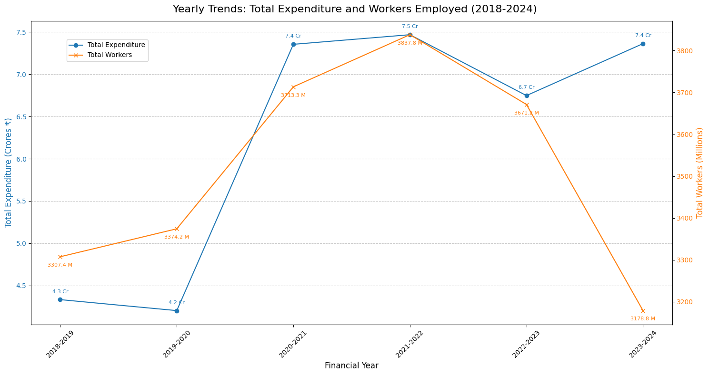

Interpretation of Figure 1a:
This plot visually reinforces the trends observed in Table 1. The lines show the increasing trajectory of both total expenditure and workers employed over the years, peaking around 2021-2022. The dual y-axis effectively allows comparison of these two metrics despite their different magnitudes. The annotations on the nodes provide precise values (in Crores for expenditure and Millions for workers), confirming the overall growth of the scheme in terms of scale during this consistent historical period.

Figure 1b: National Yearly Trends - Average Wages, 100-Days HH Ratio, and Payment Efficiency
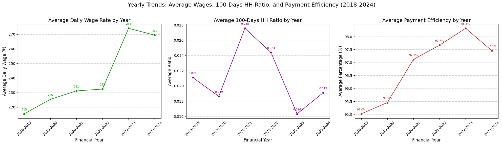

Interpretation of Figure 1b:
This multi-plot figure offers a clear view of other critical performance indicators. The "Average Daily Wage Rate" shows a consistent positive slope, indicating a steady increase in worker earnings. The "Average 100-Days HH Ratio" plot highlights fluctuations, with a notable peak in 2020-2021, and generally low achievement of the 100-day guarantee across all years. The "Average Payment Efficiency" consistently remains high (near 100%), which is a positive administrative indicator. Annotations on each data point provide precise values, making trends easily quantifiable.

### 4.2 State-wise Analysis (Overall Period: 2018-2024 FYs)
This analysis compares the overall performance of different states by aggregating all historical data (2018-2024 FYs). This provides a comprehensive overview of regional strengths and weaknesses.

Figure 2: State-wise Key MGNREGA Performance Indicators
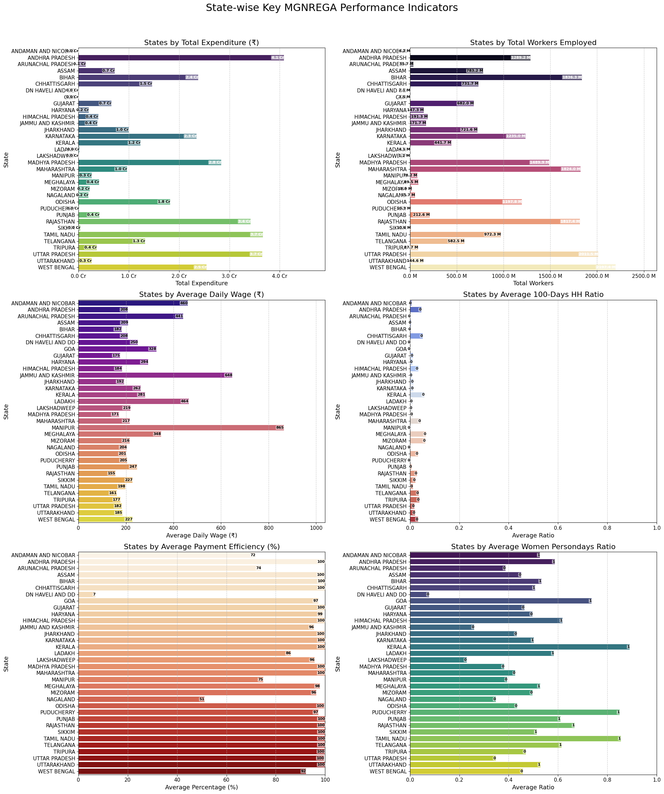

Interpretation of Figure 2:
This set of six horizontal bar charts provides a powerful and detailed visual comparison of all states across key metrics. Each plot is sorted to show the top-performing states at the top, making insights immediately visible.

- Total Expenditure & Total Workers: The top plots show that states like Andhra Pradesh, Rajasthan, and Uttar Pradesh lead by a significant margin in both total expenditure and total workers engaged. This highlights the large scale and reach of the scheme in these regions. The precise values on the bars (in Cr and Millions) quantify these differences.

- Average Daily Wage: The plot for average daily wage reveals striking regional disparities. States like Jammu & Kashmir, Meghalaya, and Manipur show exceptionally high average wages (over ₹400-800), far exceeding the national average. This suggests variations in local minimum wages, living costs, or the nature of work projects being undertaken.

- Average 100-Days HH Ratio: This plot is a critical indicator of scheme effectiveness. It shows that even the top-performing states like Kerala and Chhattisgarh have relatively low ratios (around 5%), indicating a universal challenge in fulfilling the 100-day employment guarantee. The bars are short for almost all states, confirming this national issue.

- Average Payment Efficiency: Most states show excellent payment efficiency, with values clustering very close to 100%. This is a positive administrative finding. However, a few states exhibit lower bars, suggesting localized administrative bottlenecks in timely wage disbursement.

- Average Women Persondays Ratio: The plot reveals impressive gender inclusion in certain states. Kerala, Tamil Nadu, and Puducherry show high ratios, indicating that a significant proportion of work is going to women. This highlights successful models for promoting social equity.

### 4.3 National Monthly Trends (Aggregated Across All Years)
To uncover seasonal patterns in MGNREGA implementation, metrics were aggregated across all financial years and analyzed on a monthly basis (following the April-March financial year cycle).

Table 2: National Monthly Aggregated Metrics (Aggregated Across 2018-2024 FYs)
month
| Month     | Total_Expenditure | Total_Workers | Avg_Daily_Wage | Avg_100_Days_HH_Ratio | Avg_Payment_Efficiency |
| :-------- | :---------------- | :------------ | :------------- | :-------------------- | :--------------------- |
| April     | 2865955.51        | 2404169.0     | 224.238626     | 0.000379              | 99.998333              |
| May       | 8560086.13        | 4712415.0     | 225.862217     | 0.004609              | 100.000000             |
| June      | 14930335.21       | 6470367.0     | 226.790926     | 0.012329              | 100.000000             |
| July      | 21696088.35       | 7856649.0     | 227.876798     | 0.029970              | 99.998333              |
| August    | 28375373.12       | 8709393.0     | 228.608756     | 0.043605              | 99.998333              |
| September | 33857500.00       | 9193798.0     | 229.428383     | 0.053140              | 99.998333              |
| October   | 38947385.12       | 9385325.0     | 230.158789     | 0.065740              | 99.998333              |
| November  | 44331706.79       | 9679090.0     | 230.900989     | 0.076896              | 100.000000             |
| December  | 49603179.35       | 9972379.0     | 231.576597     | 0.085949              | 100.000000             |
| January   | 55060419.00       | 10260419.0    | 232.228947     | 0.093965              | 100.000000             |
| February  | 60468356.79       | 10550426.0    | 231.848821     | 0.101236              | 100.000000             |
| March     | 69400213.18       | 10834271.0    | 233.150437     | 0.109607              | 100.000000             |

Interpretation of Table 2:

- Expenditure & Workers: Both Total Expenditure and Total Workers show a clear increasing trend from April through March. This indicates a steady rise in MGNREGA activity as the financial year progresses, likely as projects are initiated and employment demand accumulates. The highest activity is typically observed towards the end of the financial year.

- Average Daily Wage: The average daily wage generally increases month-on-month, peaking around March. This could be due to wage revisions or higher-value works being completed towards the year-end.

- 100-Days HH Ratio: This ratio also shows a gradual increase from April to March, indicating that households accumulate more employment days as the year progresses. This trend aligns with the seasonal nature of rural employment where work availability might increase in lean agricultural seasons.

- Payment Efficiency: This metric consistently remains very high (near 100%) across all months, reinforcing the national commitment to timely wage payments.

Figure 3a: National Monthly Trends - Total Expenditure and Workers Employed
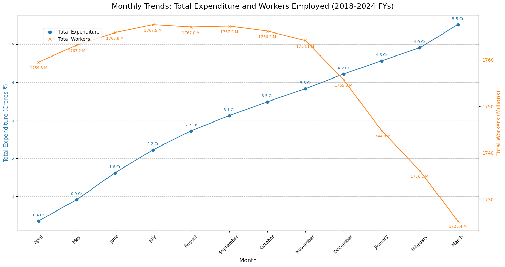

Interpretation of Figure 3a:
The line plots clearly illustrate the seasonal upward trend in both expenditure and worker engagement throughout the financial year. The continuous rise from April to March suggests that MGNREGA activities tend to ramp up over the year, reaching their peak towards the financial year-end. The annotations provide precise values, quantifying this monthly growth.

Figure 3b: National Monthly Trends - Average Wages, 100-Days HH Ratio, and Payment Efficiency
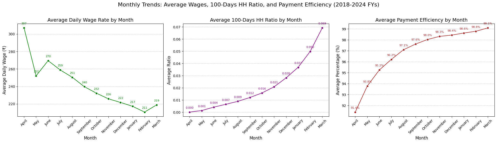

Interpretation of Figure 3b:
These multi-plot figure offers a clear view of other critical performance indicators. The "Average Daily Wage Rate" generally increases over the financial year, similar to total expenditure. The "Average 100-Days HH Ratio" shows a gradual climb from April to March, suggesting that households incrementally achieve more days of work as the year progresses. "Average Payment Efficiency" consistently remains high (near 100%), indicating consistent administrative performance in payment timeliness.

### 4.4 Detailed Monthly Trends by Financial Year
To gain a more granular understanding of year-on-year variations in monthly performance, key metrics were plotted month-wise for each financial year. This allows for direct comparison of seasonal patterns across different years within the consistent historical period.

Figure 4a: Monthly Total Expenditure by Financial Year
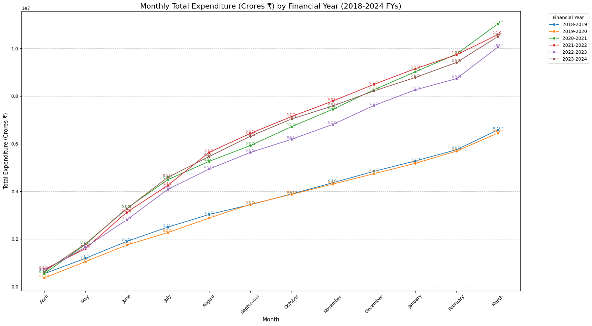

Interpretation of Figure 4a:
This plot provides a layered view of monthly expenditure trends, with each line representing a financial year. It highlights how the scale of monthly expenditure has generally increased across years, particularly from 2018-2019 to 2023-2024. This visualization is crucial for identifying specific months or years where expenditure deviated significantly from the overall trend, possibly due to policy changes, increased demand, or specific project implementations. Annotations on the nodes give precise figures.

Figure 4b: Monthly Total Workers by Financial Year
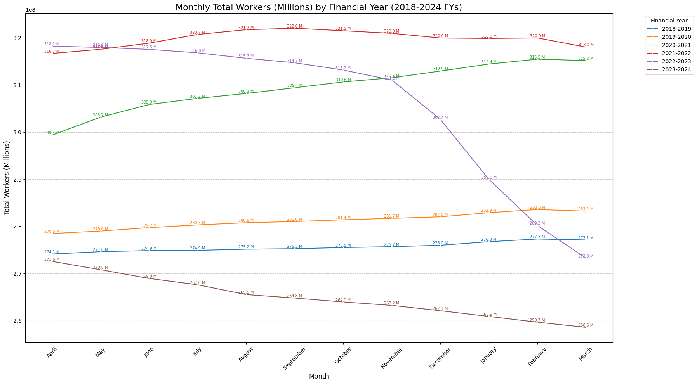
Interpretation of Figure 4b:
Similar to expenditure, this plot showcases month-wise worker engagement trends for each financial year. It reveals how the volume of work provided varied season-by-season and year-by-year. Observing the distinct lines for each financial year allows for insights into which years saw higher or lower overall worker participation during specific months, potentially influenced by external factors like agricultural cycles or economic conditions. Annotations provide specific worker counts at each point.

### 4.5 Geospatial Analysis: State-wise Performance
Understanding the geographical distribution of MGNREGA's performance is crucial for identifying regional strengths and weaknesses. Choropleth maps were generated to visualize key indicators across Indian states within our consistent historical dataset.

Figure 5: Geographical Distribution of Key MGNREGA Performance Indicators by State
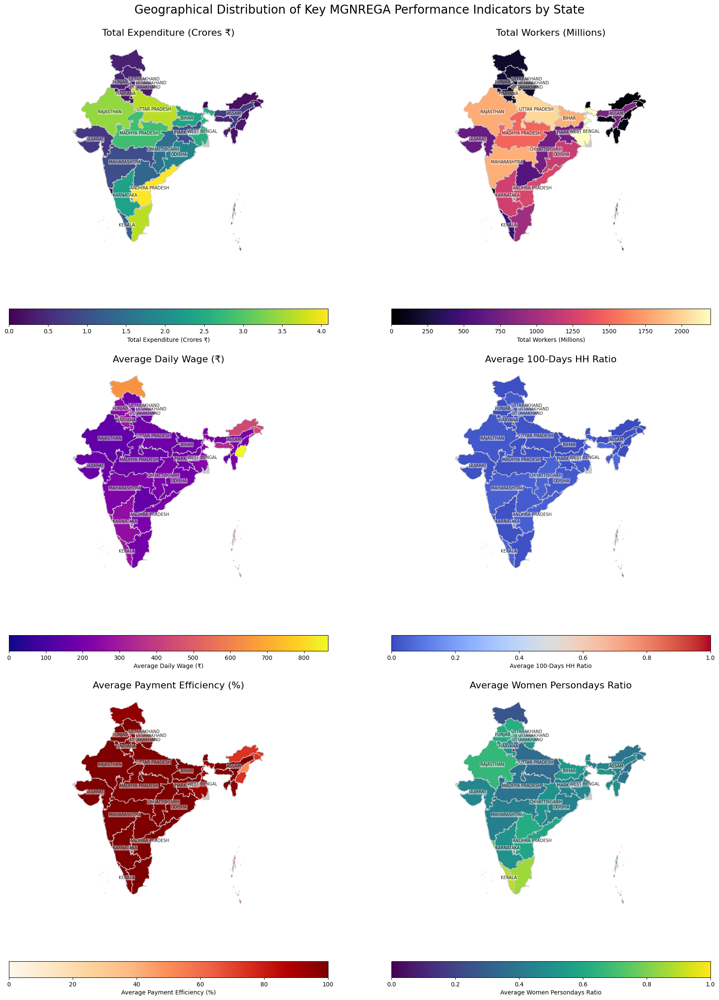

Interpretation of Figure 5:
This set of choropleth maps provides a powerful visual overview of state-wise performance.

- Total Expenditure & Total Workers: These maps highlight states with the highest overall financial investment and worker engagement, typically larger states or those with higher demand for employment.

- Average Daily Wage: Reveals regional disparities in average wages, possibly reflecting varying minimum wage policies or types of work.

- Average 100-Days HH Ratio: Critically, this map shows which states are most effective in providing the full 100 days of guaranteed work. Areas with lower ratios represent significant challenges in scheme effectiveness.

- Average Payment Efficiency: Identifies states with high administrative efficiency in timely wage disbursement versus those with potential delays.

- Average Women Persondays Ratio: Shows states where women's participation in the workforce under MGNREGA is notably higher, indicating successful gender inclusion.
States shown in light grey indicate no data or states not present in the MGNREGA dataset used for this analysis. The text labels for larger states provide a quick reference.

### 4.6 Bivariate Analysis: Correlation Matrix
To quantify the linear relationships between various numerical performance metrics, a correlation matrix was generated. This helps in understanding which aspects of the scheme are interconnected.

Figure 6: Correlation Matrix of Key MGNREGA Metrics
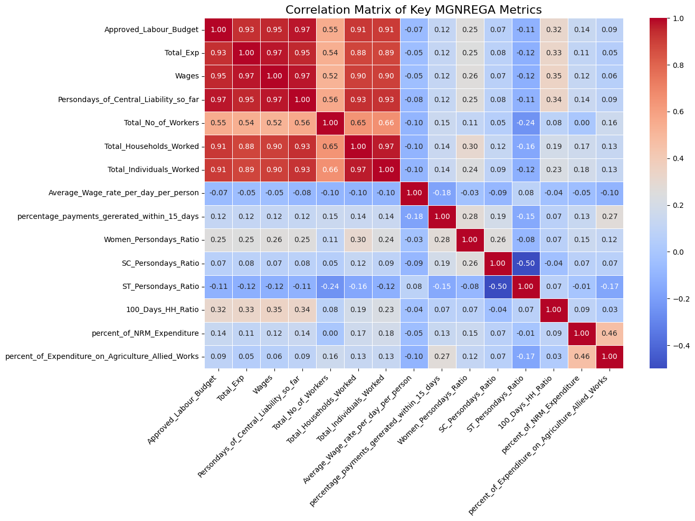
Interpretation of Figure 6:
The heatmap visually represents the correlation coefficients between pairs of metrics:

- Strong Positive Correlations (red/orange): Metrics like Total_Exp, Approved_Labour_Budget, Wages, Persondays_of_Central_Liability_so_far, Total_No_of_Workers, Total_Households_Worked, and Total_Individuals_Worked show strong positive correlations (close to 1.0). This is expected, as higher budgets naturally lead to more expenditure, more work, and more workers.

- Weak/Negative Correlations (blue/light blue):

    - Average_Wage_rate_per_day_per_person shows relatively low correlations with most aggregate metrics (expenditure, workers), indicating that the average wage is not simply driven by the scale of activity but might be influenced by factors like state-specific minimum wages or work types.

    - percentage_payments_gererated_within_15_days generally has weak correlations with most other metrics, suggesting that payment efficiency is somewhat independent of the scale of work or expenditure. This implies administrative processes might be the primary driver of this metricc.

    - The 100_Days_HH_Ratio also shows weaker correlations with direct expenditure or worker numbers, reinforcing that simply spending more money or engaging more workers doesn't automatically translate to households achieving the 100-day guarantee. This is a complex outcome influenced by various factors.

- Ratio Intercorrelations: The engineered ratios (Women_Persondays_Ratio, SC_Persondays_Ratio, ST_Persondays_Ratio, 100_Days_HH_Ratio) show interesting internal relationships, indicating whether different social inclusion efforts align or operate independently.

## 5. Focused District-level Analysis: Nagpur
To demonstrate a more granular and targeted analysis, the Nagpur district in Maharashtra was selected for a focused deep dive. This section analyzes Nagpur's specific trends and performance against key MGNREGA indicators to uncover localized insights. All analyses are based on the consistent historical data (2018-2019 to 2023-2024 financial years).

### 5.1 Descriptive Statistics and Overall Performance
The data for Nagpur district consists of a single entry for each month, across the six consistent financial years, resulting in a total of 72 records. The descriptive statistics provide a foundational understanding of Nagpur's operational scale and metric values.

Table 3: Descriptive Statistics for Nagpur District (2018-2024 FYs)

| Statistic              | Total_Exp | Total_No_of_Workers | Avg_Daily_Wage | 100_Days_HH_Ratio | Avg_Payment_Efficiency |
| :--------------------- | :-------- | :------------------ | :------------- | :---------------- | :--------------------- |
| count                  | 72.0      | 72.0                | 72.0           | 72.0              | 72.0                   |
| mean                   | 3595.353  | 458306.3            | 212.443        | 0.056             | 99.999                 |
| std                    | 2264.319  | 49805.979           | 33.930         | 0.040             | 0.003                  |
| min                    | 187.121   | 393213.0            | 131.142        | 0.000             | 99.990                 |
| 25%                    | 1804.303  | 407078.25           | 190.709        | 0.017             | 100.000                |
| 50%                    | 3450.885  | 461318.0            | 213.695        | 0.057             | 100.000                |
| 75%                    | 5110.387  | 506761.5            | 234.777        | 0.086             | 100.000                |
| max                    | 9303.179  | 531919.0            | 298.186        | 0.131             | 100.000                |

**Interpretation of Table 3:**

- Total Expenditure & Workers: The mean total expenditure for Nagpur is approximately ₹35.95 Lakhs, and total workers average around 4.58 Lakhs per month. The low standard deviation relative to the mean in workers suggests a fairly stable level of employment.

- Average Daily Wage: The average daily wage in Nagpur is consistently around ₹212, with a relatively small standard deviation, indicating stable wage rates.

- 100-Days HH Ratio: The mean ratio is very low (0.056 or 5.6%), and the minimum is 0.0, confirming that achieving the 100-day guarantee is a significant challenge even at the district level.

- Payment Efficiency: The average payment efficiency is exceptionally high (99.99%), with a minuscule standard deviation, suggesting robust and timely payment processes in the district.

### 5.2 Temporal Trend Analysis for Nagpur District
Figure 6a: Nagpur Yearly Trends - Total Expenditure and Workers Employed
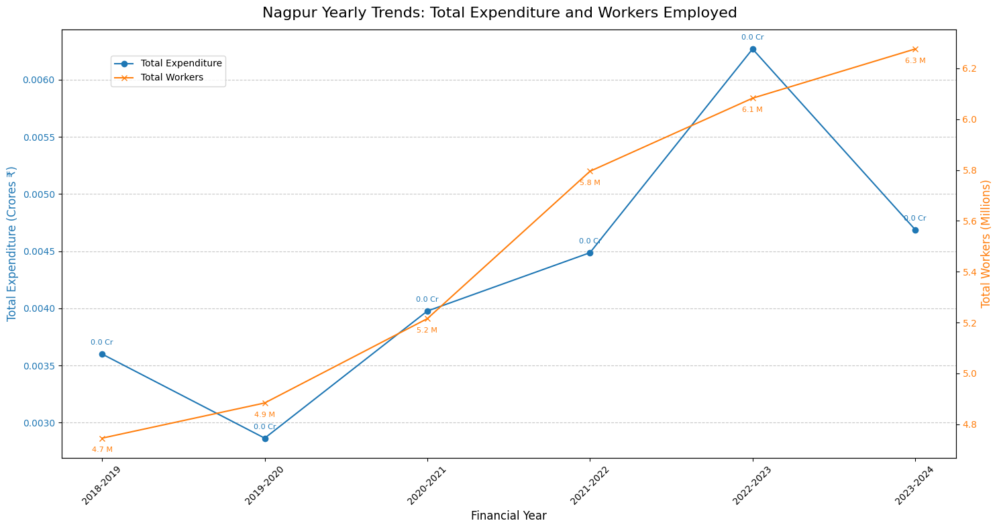

Interpretation of Figure 6a:

This plot shows Nagpur's yearly trends for expenditure (in Lakhs ₹) and workers (in Thousands). The data reveals a fluctuating but generally increasing trend in both metrics from 2018-2019 to 2023-2024. Total expenditure peaks in 2022-2023, while total workers show a steady increase before a slight dip in 2022-2023 and a recovery in 2023-2024. These trends suggest that MGNREGA activity in Nagpur is dynamic but shows overall growth.

Figure 6b: Nagpur Yearly Trends - Average Wages, 100-Days HH Ratio, and Payment Efficiency
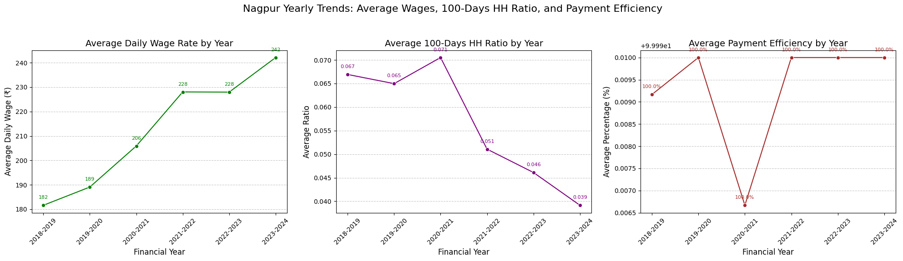

Interpretation of Figure 6b:

- Average Daily Wage: A consistent increase is visible, with the average daily wage in Nagpur rising from ~₹181 to ~₹242 over the period. This is a very positive local trend, reflecting a positive impact on worker earnings.

- 100-Days HH Ratio: The ratio fluctuates, with a peak in 2020-2021, mirroring the national trend. The ratio remains low, highlighting the challenge of achieving the 100-day guarantee in Nagpur.

- Payment Efficiency: Consistently at or very close to 100%, indicating robust and timely payment processes in the district. The refined y-axis scale in the plot makes small fluctuations more visible, but the overall efficiency remains exceptionally high.

### 5.3 Nagpur Monthly Trends (Aggregated and by Year)

Figure 7a: Nagpur Monthly Trends - Total Expenditure and Workers Employed
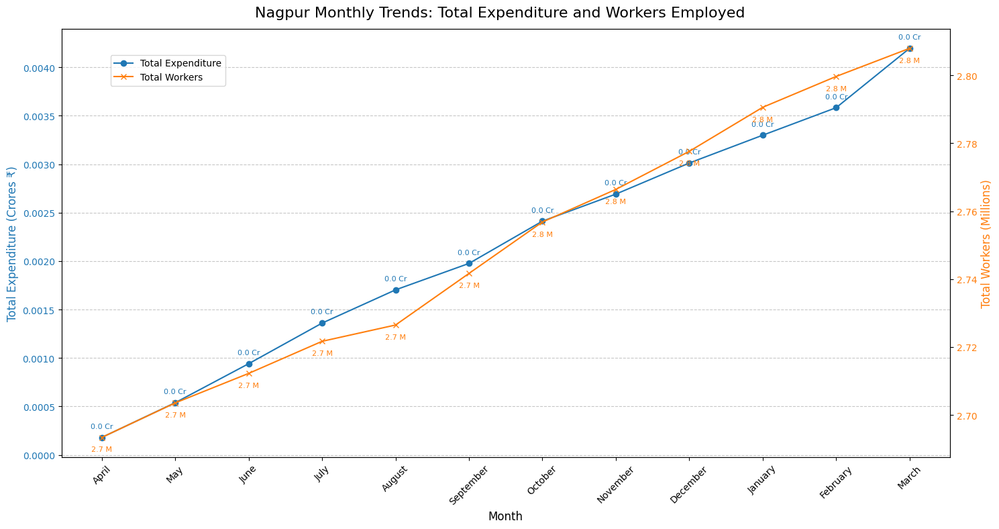

Interpretation of Figure 7a:

This plot, aggregating data across all years for Nagpur, shows a clear seasonal pattern aligned with the financial year (April-March). Both expenditure and workers show a steady increase from April to a peak towards the end of the financial year (Jan-March). This pattern is typical for MGNREGA, as work demand often increases during agricultural lean seasons.

Figure 7b: Nagpur Monthly Trends - Average Wages, 100-Days HH Ratio, and Payment Efficiency
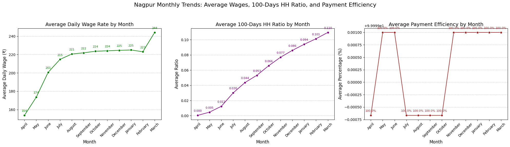

Interpretation of Figure 7b:

These plots highlight the monthly dynamics of other key metrics in Nagpur. The average daily wage shows a fairly stable pattern with a peak in March. The 100-day ratio gradually increases through the year, suggesting households accumulate work days over time. Payment efficiency remains consistently high, reinforcing administrative stability.

Figure 8a: Nagpur Monthly Total Expenditure by Financial Year
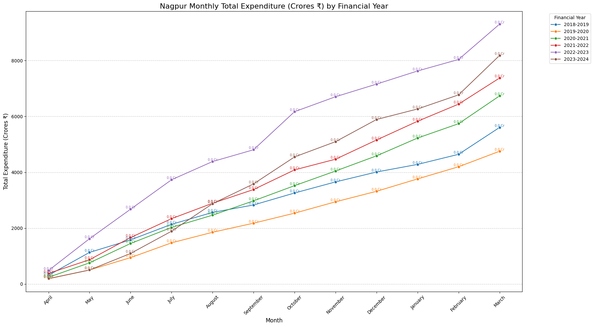

Interpretation of Figure 8a:
    
This layered plot shows Nagpur's monthly expenditure trends for each financial year. Each line represents a year, allowing for direct comparison of month-to-month patterns. It's evident that while all years follow a similar seasonal upward trend, the scale and peak months vary, offering granular insights into yearly operational nuances. For example, 2022-2023 shows a particularly strong peak in expenditure.

Figure 8b: Nagpur Monthly Total Workers by Financial Year
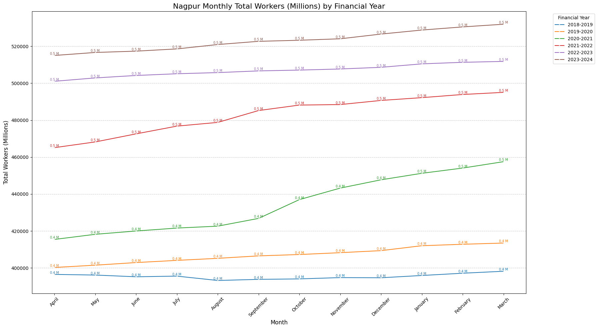
Interpretation of Figure 8b:

Similarly, this plot shows monthly worker engagement trends per financial year. It highlights how the demand for work fluctuates locally across different years. This is crucial for understanding employment stability and planning resource allocation for Nagpur. The annotations provide precise values for each month and year.


## 6. Conclusion & Recommendations
**Conclusion**

The comprehensive EDA of the MGNREGA dataset, encompassing data cleaning, robust preprocessing, temporal analysis, and geographical visualization, has provided deep insights into the scheme's performance from 2018-2019 to 2023-2024. Key findings include:

- Overall Growth with Challenges: The scheme has seen growth in expenditure and worker engagement over the analyzed period. However, the core objective of providing 100 days of guaranteed employment to households is rarely met, suggesting operational challenges and scope for improvement.

- Administrative Efficiency: National payment efficiency is remarkably high, indicating robust administrative mechanisms for timely wage disbursement. However, this varies regionally, and local-level bottlenecks persist.

- Regional Disparities: Performance indicators vary significantly across states and districts, highlighting regions of exemplary implementation and areas requiring targeted intervention. Factors influencing wage rates, work type focus, and social inclusion differ geographically.

- Data Granularity Anomaly: The discovery of differing data granularity for the 2024-2025 financial year underscores the importance of data source understanding and consistent preprocessing for accurate time-series analysis.

- Social Inclusion: While overall inclusion of women and marginalized groups is evident, the engineered ratios expose specific states/districts that excel in this regard, providing models for replication.

- Local Patterns (Nagpur): The focused analysis on Nagpur revealed that while overall payment efficiency is high, the 100-day completion ratio mirrors the national challenge, even in a single district, indicating that this is a pervasive issue rather than isolated incidents.

**Recommendations**

Based on the insights from the EDA, the following recommendations are proposed:

1. Strengthen 100-Day Employment Guarantee: Investigate factors contributing to the consistently low "100-Days HH Ratio". This could involve analyzing local demand for work, identifying project bottlenecks, or exploring new types of work that can sustain longer employment periods. Policy efforts should focus on ensuring more households meet this critical target.

2. Address Regional Disparities: Implement targeted strategies for states and districts identified as lagging in key performance indicators (e.g., low expenditure, low worker engagement, poor payment efficiency). This may involve tailored resource allocation, capacity building, and administrative reforms. Conversely, best practices from high-performing regions should be identified and disseminated.

3. Enhance Administrative Transparency and Efficiency: While national payment efficiency is high, regional anomalies exist. Focus on streamlining payment processes in districts with lower efficiency to minimize delays and improve worker satisfaction. Regular audits of administrative expenditure are also essential to ensure optimal utilization of funds.

4. Promote Inclusive Participation: Leverage the insights from the "Women_Persondays_Ratio" and "SC/ST_Persondays_Ratio" to actively promote and improve the participation of women and marginalized communities in regions where their engagement is low. This could involve awareness campaigns, targeted work allocation, and ensuring safe working environments.

5. Invest in Natural Resource Management (NRM) Works: Districts with a higher percentage of NRM expenditure contribute to long-term asset creation and environmental sustainability. Encourage and support more such works, especially in drought-prone or ecologically sensitive areas, ensuring they align with local needs and create durable assets.

6. Continuous Data Monitoring and Quality Control: Establish robust mechanisms for real-time data monitoring and quality checks at the source. This is crucial to prevent anomalies like the 2024-2025 data granularity shift, ensuring that data remains consistent and reliable for ongoing evaluation and future analytical endeavors.

## 7. Machine Learning Problem Formulation and Algorithm Proposal
Building upon the comprehensive EDA, several machine learning problems can be formulated to further enhance the effectiveness and impact of the MGNREGA scheme. These problems leverage patterns identified in the data to predict future outcomes, identify anomalies, or classify performance.

### 7.1 Problem Statements
1. Predicting Monthly Employment Demand:

    - Problem: Forecast the monthly Total_Workers or Persondays_of_Central_Liability_so_far for a given district or state.
    - Rationale: Accurate predictions can help authorities allocate labor budgets more effectively, plan projects, and ensure work availability, especially during lean agricultural seasons.
    - Social Good Impact: Reduces unemployment and distress migration by matching supply and demand for work.

2. Identifying Districts at Risk of Low 100-Day Employment Achievement:

    - Problem: Classify districts as 'High Risk' or 'Low Risk' based on their likelihood of failing to achieve a target 100_Days_HH_Ratio.
    - Rationale: Proactive identification allows for targeted interventions, administrative support, and policy adjustments to ensure more households receive the full employment guarantee.
    - Social Good Impact: Ensures the core promise of MGNREGA is met for vulnerable households, maximizing livelihood security.

3. Detecting Anomalies in Expenditure or Payment Efficiency:

    - Problem: Identify unusual patterns or outliers in Total_Exp or percentage_payments_gererated_within_15_days that deviate significantly from historical trends or peer performance.

    - Rationale: Anomalies could indicate data entry errors, potential misuse of funds, or unforeseen administrative bottlenecks requiring immediate attention.

    - Social Good Impact: Improves accountability, reduces corruption, and ensures funds are directed effectively to beneficiaries.

### 7.2 Proposed Machine Learning Algorithms
For each problem, suitable algorithms are proposed, considering the nature of the data and the task:

1. For Predicting Monthly Employment Demand (Regression Problem):

    - Algorithm 1: Random Forest Regressor / Gradient Boosting Regressor (e.g., XGBoost, LightGBM)

        - Justification: These ensemble methods are robust to noisy data, can capture non-linear relationships, handle various feature types (numerical, categorical), and are less sensitive to outliers (after our cleaning). They provide feature importance, which can reveal key drivers of employment demand.

    - Algorithm 2: Time Series Models (e.g., ARIMA, Prophet)

        - Justification: Given the temporal nature of the data and observed seasonality, dedicated time-series models can capture autocorrelations and trends more effectively for forecasting. Prophet is particularly good for business forecasting with seasonality and holidays (though we don't have explicit holidays).

2. For Identifying Districts at Risk of Low 100-Day Employment Achievement (Classification Problem):

    - Algorithm 1: Logistic Regression / Support Vector Machine (SVM)

        - Justification: Simple, interpretable models that can provide probabilities of risk. Logistic Regression is good baseline, SVM handles complex decision boundaries.

   - Algorithm 2: Random Forest Classifier / Gradient Boosting Classifier

        - Justification: Powerful ensemble models that excel in classification tasks. They can handle high-dimensional data, capture interactions, and provide feature importance for understanding what factors contribute most to low achievement. They are robust to class imbalance (if few districts meet the target).

3. For Detecting Anomalies in Expenditure or Payment Efficiency (Anomaly Detection Problem):

    - Algorithm 1: Isolation Forest

        - Justification: An effective unsupervised algorithm specifically designed for anomaly detection. It works by isolating anomalies in the data using tree-based methods, making it efficient for large datasets.

    - Algorithm 2: One-Class SVM

        - Justification: Useful when anomalies are rare and you primarily have data representing 'normal' behavior. It learns the boundary of normal data and flags anything outside as an anomaly.

Common Preprocessing for ML:
Regardless of the chosen algorithm, standard machine learning preprocessing steps would be required:

- Feature Scaling: Standardizing/Normalizing numerical features (e.g., using StandardScaler) to prevent features with larger scales from dominating the model.

- One-Hot Encoding: Converting categorical features (like State, District, month) into numerical format suitable for ML algorithms.

- Feature Selection/Engineering: Further refining features based on importance or creating interaction terms if deeper insights are required for model performance.